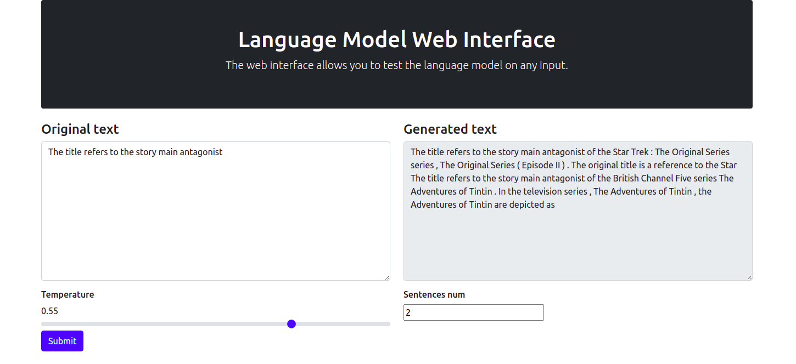

# Language model Web Interface
### Воропаев Роберт, М05-012e



## Установка и запуск

Необходимо иметь актуальную версию python3.

```angular2html
pip3 install -r requirements.txt
python3 run.py
```

Запущенный интерфейс появится по адресу http://127.0.0.1:5000/.

## Файлы проекта
* app/*.py - логические файлы в структуре Flask
* app/templates/*.html - HTML шаблоны вывода
* models - сохранённые веса модели
* run.py - главный исполняемый файл
